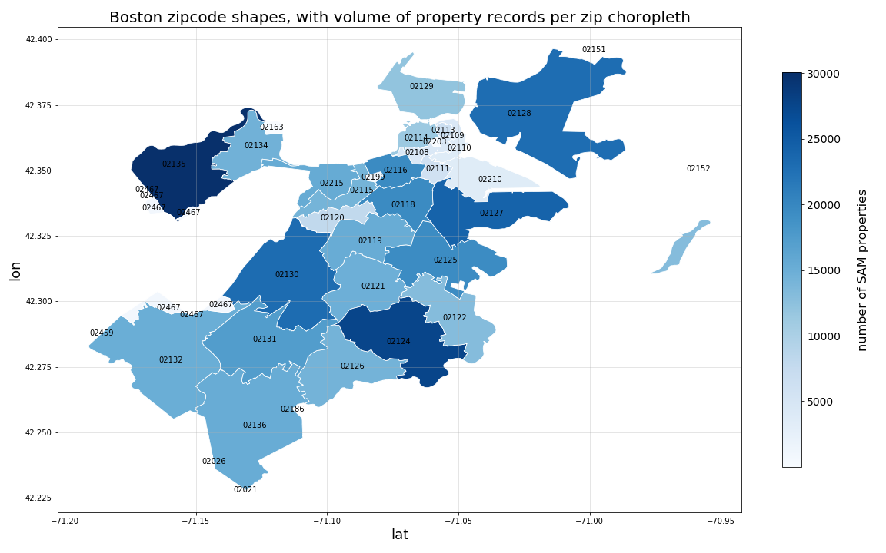

# Geopandas tutorial

## Summary

This repository contains basic tutorial for using the geopandas, shapely, and fiona python libraries for working with geographic data, shapefiles, and the like.

This is by no means an exhaustive tutorial. Rather, the goal is to document basic functionality and tasks, from which a user can begin to perform more complex actions using each library.

## Getting started with this tutorial

### Step 1: Install and start the required conda virtual environment

- The `geopandas-tutorial.yml` file contains specifications for building your virtual environment and related dependencies using the `conda` package manager
- To install your virtual environment, clone this repository.
- Navigate to your newly cloned repository via your terminal and run the following command:
    - `conda env update --prefix ./env --file geopandas-tutorial.yml`
- Once your dependencies are installed, if you are in a linux terminal, you can activate the resulting conda environment by running the following command:
    - `conda activate ./env`
- For additional information on creating, managing, and running `conda` environments, please see the official Anaconda documentation:
    - https://docs.conda.io/projects/conda/en/latest/user-guide/tasks/manage-environments.html

### Step 2: Start the Jupyter notebook server and follow along with the tutorial

- Once your environment is running (as outlined in Step 1 above), you can start up the Jupyter notebook server to follow along with the tutorial by running the following command from within your local copy of this git repository: `jupyter notebook`
- From within the jupyter notebook server browser interface, navigate to and open the `geopandas-tutorial.ipynb` file.
- Note that the first time you work through the notebook, the included code will download the below listed (required) data sources to the `./data/` directory for use in the tutorial.
- If, for any reason the notebook-based data download fails, you can always navigate to the data source links below and manually download each file to your local `./data/` directory.  

## Data Sources:

Raw data sources used for this analysis can be found at:

1. City of Boston, Analyze Boston, Zipcode shapefile:
    - https://data.boston.gov/dataset/zip-codes
    - Current shapefile .zip download: http://bostonopendata-boston.opendata.arcgis.com/datasets/53ea466a189b4f43b3dfb7b38fa7f3b6_1.zip
    - Note that the "current download" hash will likely change with dataset updates, therefore, please navigate to the main download page and download the most recent version

2. City of Boston. Analyze Boston, Boston Street Address Management (SAM) Properties:
    - https://data.boston.gov/dataset/live-street-address-management-sam-addresses
    - Current CSV download: http://bostonopendata-boston.opendata.arcgis.com/datasets/b6bffcace320448d96bb84eabb8a075f_0.csv
    - Note that the "current download" hash will likely change with dataset updates, therefore, please navigate to the main download page and download the most recent version

3. City of Boston. Analyze Boston, FY19 Property Assessment:
    - https://data.boston.gov/dataset/property-assessment
    - Current FY19 CSV download: https://data.boston.gov/dataset/e02c44d2-3c64-459c-8fe2-e1ce5f38a035/resource/695a8596-5458-442b-a017-7cd72471aade/download/fy19fullpropassess.csv

## Sample Geopandas Plot:

Below is a sample choropleth plot created in this tutorial...

